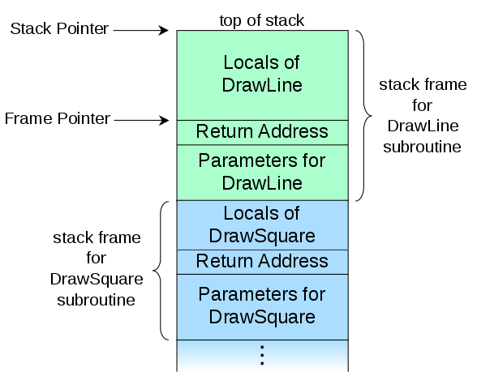
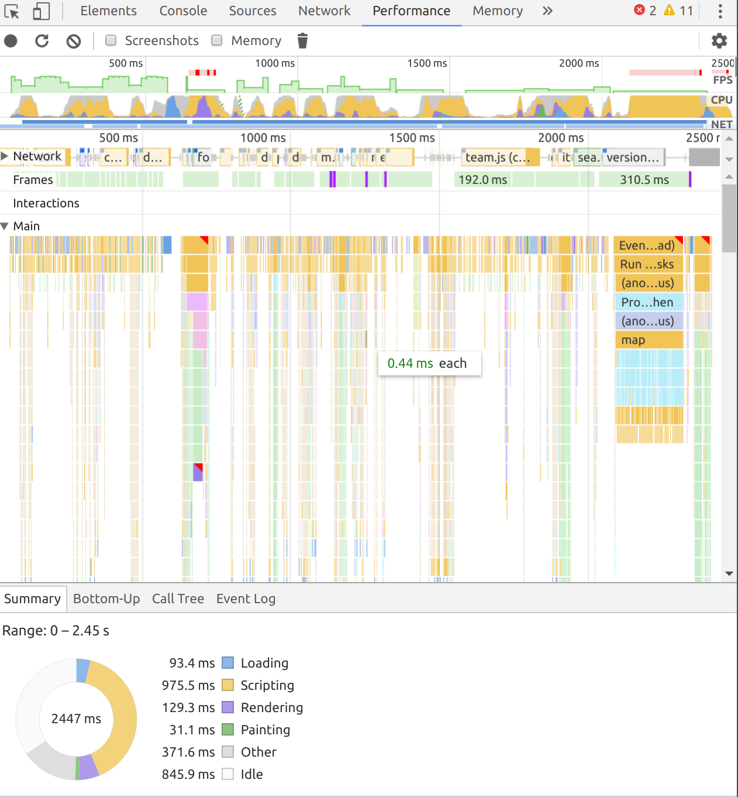
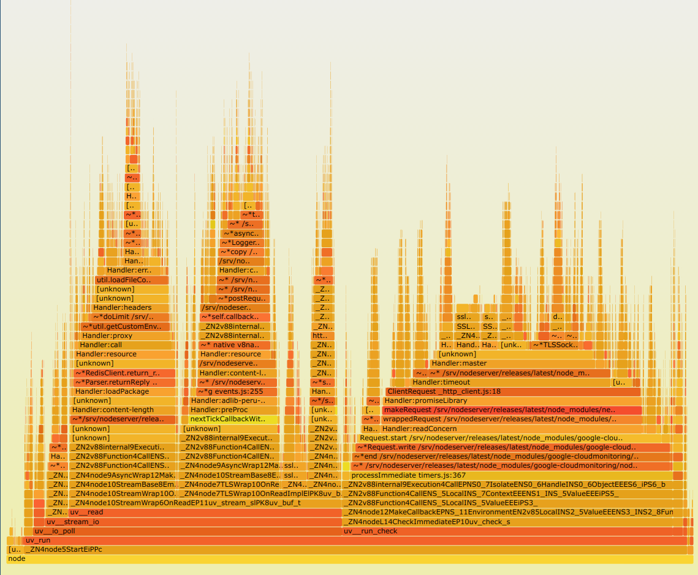
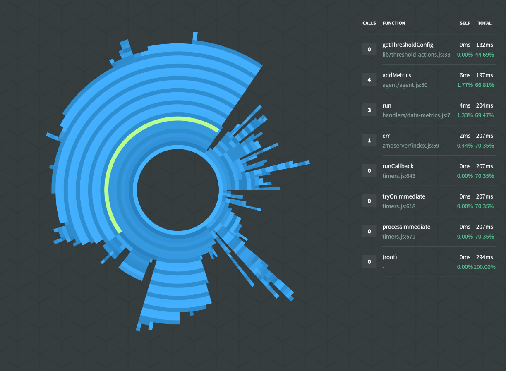
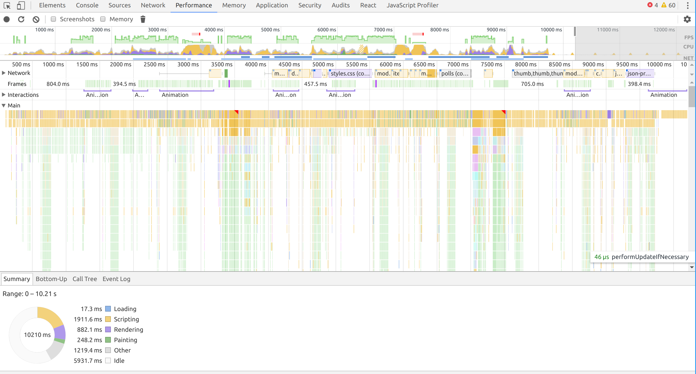
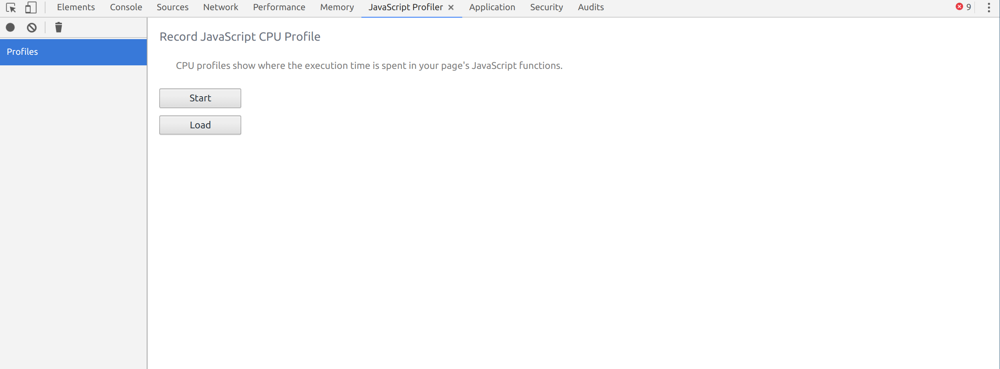
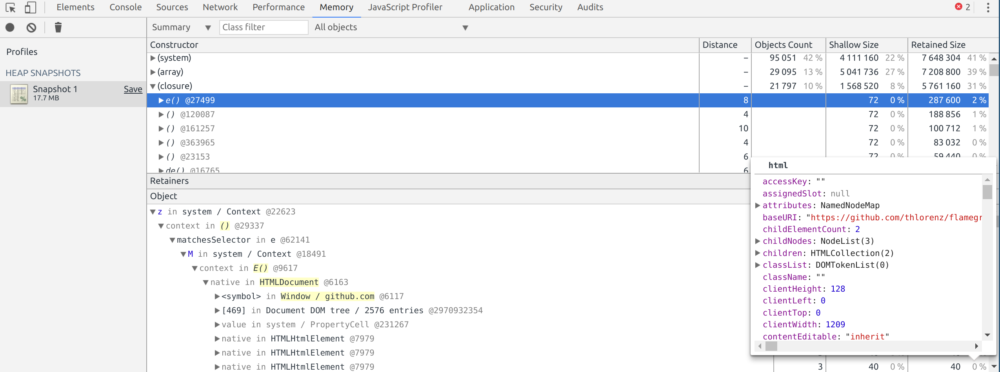

title: Javascript Performance Tracing
class: animation-fade
layout: true

<!-- This slide will serve as the base layout for all your slides -->
.bottom-bar[
  {{title}}
]

---

class: impact

# {{title}}
## The good parts
### Lars Jacob (@jaclar)

---
class: full
background-image: url('./img/iamat.png')

--
class: overlay

.col-6[
## ¿Quienes somos?

- Plataforma de "Augmented Experience" / Segunda Pantalla
- Framework de desarrollo de apps moviles rapido
- Interacción con el usuario en .small[(hipster)] tiempo real
- Comprado por Globant en Octubre 2015
]

--

.col-6[
## Tech Stack

- node.js
- MongoDB
- Redis
- Google Cloud Platform
- React/Redux
- Android y iOS nativo
]

---
class: overlay
background-image: url('./img/messi.jpg')

.col-6[
## Casos de exito

- **Messi App Oficial!!!**
- eltrece
- Mi telefe
- Gran Hermano
- Futbol para todos
- C5N
- TVN
- muchos, muchos más...

]

--

.col-6[
## Stats

- *1.2M* usuarios únicos por mes
- Messi *200k* en 2 dias
- *10M* Apps bajadas
- *24.561.292 votos* recibidos
- Evento típico *200k RPM*

]

---

# ¿Para que sirve?

## ¡Mala performance es un bug!

- En el *backend* pone en **peligro** la **estabilidad** de la plataforma
- En el *frontend* causa una **mala experiencia** para el usuario
- A veces es difícil solamente viendo el código, saber donde hay cuellos
  de botella de performance

---

# ¿Como funciona?

.col-6[

- Cada lenguaje de programación mantiene un call stack.
- Un profiler inspecciona el programa mientras que corre con mucha
  frecuencia y guarda el stackframe de esos momentos.
- Con esa información se puede recuperar cuando tiempo se gastó en
  cada parte del código.

]

.col-6.responsive[]

---

# Tipos de Visualizaciones

--

.col-4[
### Timeline


]

--

.col-4[
### Flamegraph


]

--

.col-4[
### Sunburst


]

---
class: full

<iframe src="./img/flamegraph.svg" frameborder="0" scrolling="0" width="100%" height="800px"></iframe>

---

# Profiling en el lado del cliente (Chrome)

.col-4[

- Chrome Dev Tools recién introdujo el performance tab
- Combina CPU profiling y otros timings importantes
- Network
- Interactions
- Rendering
- etc.

]

.col-8[]

---

## CPU profiling (JavaScript)

- Viejo CPU Profiler todavía existe
- 'tres puntos' -> More Tools -> JavaScript Profiler
- puede cargar `*.cpuprofile` .small[(los generamos mas tarde)]



---

## Heap snapshots

- En general se usa para detectar memory leaks.
- Especialmente closures pueden retener muchos objetos del garbage
  collector



---

# Profiling en el lado del servidor (node.js)

- Como node.js usa V8 como engine de JavaScript podemos usar los
  mismos herramientas de Chrome DevTools
- Desde v6 node implementa *Chrome Debugging Protocol* con
  `--inspect`

``` bash
$ node --inspect
Debugger listening on port 9229.
Warning: This is an experimental feature and could change at any time.
To start debugging, open the following URL in Chrome:
    chrome-devtools://devtools/remote/serve_file/@60cd6e859b9f5...
>

```

- pero que hacemos si tenemos código en producción o node v4?

---

## dtrace, perf y amigos - **OS tools to the rescue!**

- Hace mucho tiempo los sistemas operativos incluyen herramientas para
  inspeccionar procesos (`strace`, `dtrace`, etc)
- `node --perf-basic-prof` expone simbolos de V8

.col-6[
`dtrace`

- Originalmente de *Solaris* (ahora tb. *macOS*, *freeBSD* y *Linux*
- Tiene super-poderes y casi no tiene overhead
]

.col-6[
`perf`

- Incluido en el kernel de *Linux*
- Y funciona... quien ya tiene la suerte de trabajar con BSD o
  openSolaris en producción?

]

--

Que se usa en Windows? .small[(Quien ya tiene la mala suerte de tener que trabajar con Windows en producción?)]

---

## Ejemplo: `perf`

Oneliner:
``` bash
perf record -e cycles:u -g -- node --perf-basic-prof index.js
```

--

Inspeccionar proceso que ya esta corriendo:
``` bash
$ node --perf-basic-prof index.js &
[1] 11465
$ perf record -e cycles:u -g -p 11465
```

---

## Generar CPU Profile y Flamegraph

``` bash
$ ls
index.js isolate-0x3723e90-v8.log perf.data
$ perf script > perf.script
$ ls
index.js isolate-0x3723e90-v8.log perf.data perf.script
$ npm install -g cpuprofilify flamegraph
$ cat perf.script | node cpuprofilify > perf.cpuprofile
# cleanup file from "
$ sed -i.orig -e s#\\\\\"#\\\'#g *.cpuprofile
$ cat perf.cpuprofile | flamegraph -t cpuprofile > perf.svg
```

---
class: center

## Real life flamegraph de I am at


Durante un load test de rutina...

--

.center-small[]

---
class: center

  ... detectamos que los application servers consumieron
mucho mas CPU de lo esperado durante votaciones.


En pruebas locales no pudimos reproducir el problema *(obvio... )*

--

.center-small[]

--

Entonces generamos flamegraphs del lado local y del lado del servidor
y nos pusimos a ver donde están los diferencias


---

class: full, middle, center
background-image: url('./img/flamegraph-local.png')

--

class: overlay

# Local
.center-small[]

---

class: full, middle, center
background-image: url('./img/flamegraph-sample.png')

--

class: overlay

# Producción

---

# References

- Call stack: https://en.wikipedia.org/wiki/Call_stack#Inspection
- Flame Graphs:
  http://www.brendangregg.com/FlameGraphs/cpuflamegraphs.html
- Linux tracers: http://www.brendangregg.com/blog/2015-07-08/choosing-a-linux-tracer.html
- `cpuprofilify`: https://github.com/thlorenz/cpuprofilify
- `flamegraph`: https://github.com/thlorenz/flamegraph
- Chrome Debugging Protocol: https://chromedevtools.github.io/devtools-protocol/

---

class: full

<iframe src="https://2017.nodeconf.com.ar" frameborder="0" scrolling="0" width="100%" height="800px"></iframe>
