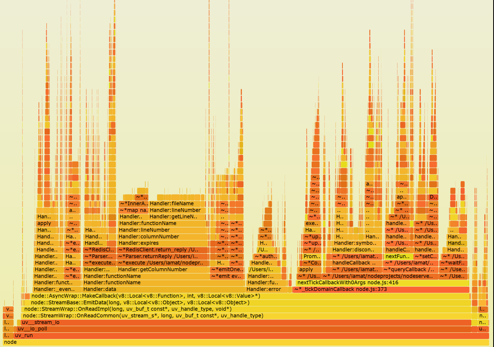

title: Javascript Performance Tracing
class: animation-fade
layout: true

<!-- This slide will serve as the base layout for all your slides -->
.bottom-bar[
  {{title}}
]

---

class: impact

# {{title}}
## The good parts
### Lars Jacob (@jaclar)

---

# ¿Para que sirve?

## ¡Mala performance es un bug!

- En el *backend* pone en **peligro** la **estabilidad** de la plataforma
- En el *frontend* causa una **mala experiencia** para el usario
- A veces es dificil solamente viendo el codigo, donde hay cuellos de botella en el codigo

---

# ¿Como funciona?

.col-6[

- Cada lenguaje de programación mantiene un call stack.
- Un profiler inspeciona el programa mientras que corre con mucha
  frequencia y guarda el stackframe de esos momentos.
- Con esa información se puede recuperar cuando tiempo se gastó en
  cada parte del codigo.

]

.col-6.responsive[]

---

# Tipos de Visuzalizaciones

--

.col-4[
### Timeline


]

--

.col-4[
### Flamegraph


]

--

.col-4[
### Sunburst


]


---

# Profiling en el lado del cliente (Chrome)

.col-4[

- Chrome Dev Tools recien introdujo el performance tab
- Combina CPU profiling y otros timings importantes
- Network
- Interactions
- Rendering
- etc.

]

.col-8[]

---

## CPU profiling (JavaScript)

- Viejo CPU Profiler todavia existe
- 'tres puntos' -> More Tools -> JavaScript Profiler
- puede cargar `*.cpuprofile` .small[(los generamos mas tarde)]


---

## Heap snapshots

- En general se usa para detectar memory leaks.
- Espeicialmente closures pueden retener muchos objetos del garbage
  collector


---

# Profiling en el lado del servidor (node.js)

- Como node.js usa V8 como engine de JavaScript podemos usar los
  mismos heramientas de Chrome DevTools
- Desde v6 node implementa *Chrome Debugging Protocol* con
  `--inspect`

``` bash
$ node --inspect
Debugger listening on port 9229.
Warning: This is an experimental feature and could change at any time.
To start debugging, open the following URL in Chrome:
    chrome-devtools://devtools/remote/serve_file/@60cd6e859b9f5...
>

```

- pero que hacemos si tenemos codigo en produccion o node v4?

---

## dtrace, perf y amigos - **OS tools to the rescue!**

- Hace mucho tiempo los sistemas operativos incluyen heramientas para
  inspeccionar processos (`strace`, `dtrace`, etc)
- `node --perf-basic-prof` expone simbolos de V8

.col-6[
`dtrace`

- Originalmente de *Solaris* (ahora tb. *macOS*, *freeBSD* y *Linux*
- Tiene super-poderes y casi no tiene overhead
]

.col-6[
`perf`

- Incluido en el kernel de *Linux*
- Y funciona... quien ya tiene la suerte de trabajar con BSD o
  openSolaris en produccion?

]

--

Que se usa en Windows? .small[(Quien ya tiene la mala suerte de tener que trabjar con Windows en produccion?)]

---

## Ejemplo: `perf`

Oneliner:
``` bash
perf record -e cycles:u -g -- node --perf-basic-prof index.js
```

--

Inspeccionar processo que ya esta corriendo:
``` bash
$ node --perf-basic-prof index.js &
[1] 11465
$ perf record -e cycles:u -g -p 11465
```

---

## Generar CPUProfile y Flamegraph

``` bash
$ ls
index.js isolate-0x3723e90-v8.log perf.data
$ perf script > perf.script
$ ls
index.js isolate-0x3723e90-v8.log perf.data perf.script
$ npm install -g cpuprofilify flamegraph
$ cat perf.script | node cpuprofilify > perf.cpuprofile
# cleanup file from "
$ sed -i.orig -e s#\\\\\"#\\\'#g *.cpuprofile
$ cat perf.cpuprofile | flamegraph -t cpuprofile > perf.svg
```

---

## Real life flame graph de I am at

- Durante load test nos dio cuenta que los node application servers
  conumieron mucho mas CPU de lo esperado durante votaciones
- En pruebas locales no pudimos reproducir el problema (obvio... )
- Entonces generamos flamegraphs del lado local y del lado del servidor
  y nos pusimos a ver donde estan los diferencias

---

### Local

.col-8[]

---

### Produccion

.col-8[]

---

# References

- Call stack: https://en.wikipedia.org/wiki/Call_stack#Inspection
- Flame Graphs:
  http://www.brendangregg.com/FlameGraphs/cpuflamegraphs.html
- Linux tracers: http://www.brendangregg.com/blog/2015-07-08/choosing-a-linux-tracer.html
- `cpuprofilify`: https://github.com/thlorenz/cpuprofilify
- `flamegraph`: https://github.com/thlorenz/flamegraph
- Chrome Debugging Protocol: https://chromedevtools.github.io/devtools-protocol/
